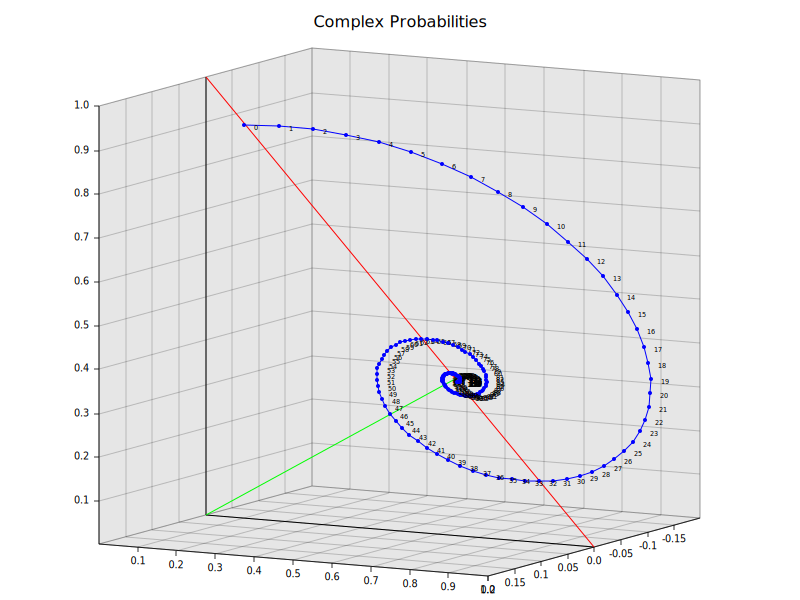

## Theory
Oscillations occur when there are negative eigenvalues in the stochastic transition matrix. The continous extension of each transformation then results in complex valued probabilites.
For a stocastic matrix, there is always one eigenvalue of 1, and all others fall between [-1, 1]. For a two state system, a negative eigenvalue results when `a + b < 1`, where a and a are the self transition probabilities of each state.


### Example for a two state system
```
Stochastic Matrix
  ┌         ┐
  │ 0.5 0.9 │
  │ 0.5 0.1 │
  └         ┘


Eigenvalues
  ┌      ┐
  │    1 │
  │ -0.4 │
  └      ┘


Eigenvectors
  ┌                     ┐
  │  0.6428571428571428 │
  │ 0.35714285714285715 │
  └                     ┘


  ┌    ┐
  │  1 │
  │ -1 │
  └    ┘
```



The red line represents the space of real probabilities where `P(A) + P(B) = 1`. The green line represents the asymptotic eigenvector corresponding to eigenvalue 1.

### Usage
First install rust and cargo.
`cargo run (-- --help)`
Outputs to `plot.svg`.
